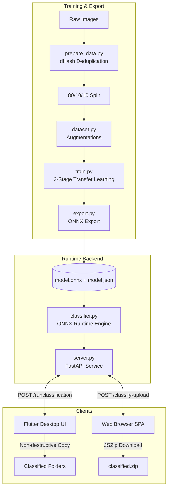

# GalleryClassifier 🖼️⚡

An end-to-end, AI-powered image classification and gallery organization system. **GalleryClassifier** automatically scans, categorizes, and organizes cluttered collections of images into four core functional buckets:

- 📸 **Photos / Camera** — Real-world photographs taken via cameras or smartphones.
- 😂 **Memes** — Humorous images, image macros, and social media media with text overlays.
- 📱 **Screenshots** — Screen captures of mobile or desktop interfaces and chat receipts.
- 🌄 **Wallpapers** — Digital art, aesthetic graphics, and high-resolution scenery.

---

## ✨ Features

- **High-Accuracy Classification:** Powered by a fine-tuned **EfficientNet-B0** model achieving **97.16% validation accuracy**.
- **Ultra-Lightweight CPU Inference:** Exported to **ONNX** (~16.7 MB) with dynamic batching. The runtime inference service runs purely on `onnxruntime`, `Pillow`, and `numpy` without requiring PyTorch in production.
- **Dual Frontends:**
  - **Flutter Desktop App** ([frontend/](frontend/)): Features a dual-tab Explorer vs. Classified view, folder navigation, thumbnail previews, and non-destructive categorized copying.
  - **Web Application** ([web/](web/)): A modern, dark-mode single-page interface with drag-and-drop batch upload, category metrics, and instant client-side ZIP packaging via **JSZip**.
- **Data-Centric Preprocessing:** Perceptual difference hashing (`dHash`) deduplication and per-class augmentation constraints tailored to real-world image properties (e.g. orientation locks on screenshots and memes).

---

## 🏗️ Architecture & Workflow



---

## 📂 Project Structure

```text
GalleryClassifier/
├── backend/
│   ├── runtime/                    # Lightweight inference & serving
│   │   ├── classifier.py           # Pure ONNX inference module
│   │   ├── model.json              # Model metadata & normalisation parameters
│   │   ├── model.onnx              # Exported ONNX model graph
│   │   ├── model.onnx.data         # Model tensor weights
│   │   ├── requirements.txt        # Runtime dependencies (FastAPI, ONNX Runtime)
│   │   └── server.py               # FastAPI backend server
│   └── training/                   # Model training pipeline
│       ├── checkpoints/            # PyTorch checkpoints (.pt)
│       ├── config.py               # Hyperparameters & path configurations
│       ├── dataset/                # Train / val / test datasets
│       ├── dataset.py              # PyTorch Dataset & augmentation policies
│       ├── export.py               # PyTorch to ONNX exporter
│       ├── logs/                   # Training CSV metrics
│       ├── model.py                # EfficientNet-B0 architecture
│       ├── prepare_data.py         # dHash deduplication & splitting
│       ├── requirements.txt        # Training dependencies (PyTorch, Torchvision)
│       └── train.py                # Two-stage fine-tuning script
├── frontend/                       # Cross-platform Flutter desktop client
│   ├── lib/
│   │   └── main.dart               # App entrypoint & UI state management
│   ├── pubspec.yaml                # Flutter project specifications
│   └── README.md                   # Frontend-specific documentation
├── web/
│   └── index.html                  # Standalone Web application
├── bing_scraper.py                 # Auxiliary Bing image scraper for dataset expansion
└── README.md                       # Main project documentation
```

---

## 🚀 Quick Start

### 1. Prerequisites

- **Python 3.10+**
- (Optional for Desktop UI) **Flutter SDK 3.0+**
- Modern web browser (Chrome, Firefox, Edge, Safari)

---

### 2. Backend Server Setup

1. **Navigate to the backend and create a virtual environment:**

   ```bash
   cd /home/muruga/workspace/GalleryClassifier
   python3 -m venv venv
   source venv/bin/activate
   ```

2. **Install runtime dependencies:**

   ```bash
   pip install -r backend/runtime/requirements.txt
   ```

3. **Launch the FastAPI server:**
   ```bash
   python -m backend.runtime.server
   ```
   _The server will start on `http://localhost:8000`._  
   _API documentation is available at `http://localhost:8000/docs`._

---

### 3. Running the Clients

#### Option A: Web Interface (Simplest)

- Open [web/index.html](web/index.html) directly in any web browser, or serve it locally:
  ```bash
  python3 -m http.server 3000 --directory web
  ```
- Visit `http://localhost:3000`, drag and drop images, and click **Classify**. Download the organized folders as a `.zip` when finished.

#### Option B: Flutter Desktop Client

```bash
cd frontend
flutter pub get
flutter run -d linux   # or -d windows / -d macos / -d chrome
```

---

## 🧠 Model Training & Export

If you wish to train the model from scratch or update it on new data:

### 1. Install Training Dependencies

```bash
pip install -r backend/training/requirements.txt
```

### 2. Prepare & Deduplicate Dataset

Organize raw data into `backend/training/images/<class_name>` and run:

```bash
python backend/training/prepare_data.py
```

_Applies 64-bit dHash deduplication (Hamming distance threshold $\le 10$) and creates an 80/10/10 split in `backend/training/dataset/`._

### 3. Execute Two-Stage Fine-Tuning

```bash
python backend/training/train.py
```

- **Stage 1 (5 epochs):** Backbone is frozen; only the classification head is trained ($LR = 10^{-3}$).
- **Stage 2 (25 epochs):** Full model fine-tuning with Cosine Annealing schedule ($LR = 10^{-4} \rightarrow 10^{-6}$).
- Checkpoints are automatically saved to `backend/training/checkpoints/`.

### 4. Export to ONNX

```bash
python backend/training/export.py --checkpoint backend/training/checkpoints/stage2_best.pt --output backend/runtime/model.onnx
```

---

## 📡 API Reference

### `POST /runclassification`

Recursively scans a filesystem path, classifies supported images, and returns file summaries.

- **Request Body:**
  ```json
  {
    "path": "/home/user/Pictures"
  }
  ```
- **Response (200 OK):**
  ```json
  {
    "photos": { "count": 142, "size_bytes": 48293100, "files": ["..."] },
    "memes": { "count": 35, "size_bytes": 5218390, "files": ["..."] },
    "screenshot": { "count": 88, "size_bytes": 14285030, "files": ["..."] },
    "wallpaper": { "count": 14, "size_bytes": 22910400, "files": ["..."] }
  }
  ```

### `POST /classify-upload`

Classifies up to 20 uploaded image files sent as `multipart/form-data`.

- **Request:** `files`: List of image files.
- **Response (200 OK):** Categorized counts, byte sizes, and original file names for client blob mapping.
